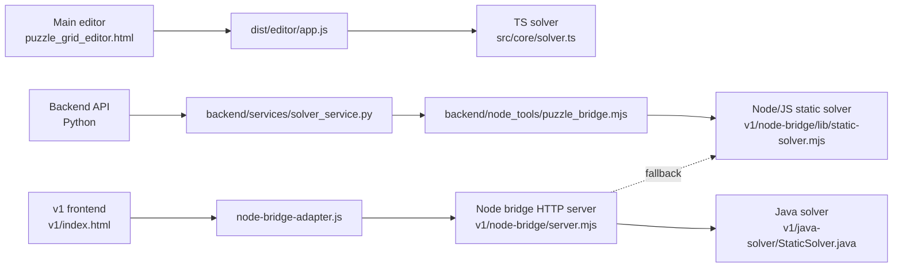
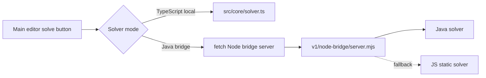

# Solver Architecture

## Current Topology



## What This Means

- The main editor currently solves locally in the browser with the TypeScript BFS solver.
- The backend service is written in Python, but it does not solve in Python.
- The backend service shells out to Node, and Node currently calls the JS static solver.
- The `v1` frontend already has a bridge adapter that can call the Node bridge server.
- The Node bridge server prefers Java and falls back to JS if Java fails.

## Runtime Paths

### 1. Main editor today

```text
Browser
  -> dist/editor/app.js
  -> src/dist core solver logic
  -> local TypeScript BFS result
```

### 2. Backend inspection path today

```text
Python service
  -> Node bridge script
  -> JS static solver
  -> JSON result back to Python
```

### 3. v1 bridge path

```text
Browser
  -> fetch http://127.0.0.1:3210/solve
  -> Node bridge server
  -> Java solver
  -> fallback to JS solver if Java fails
```

## Compatibility Notes

- The main editor supports wind and settle-mode environment logic.
- The Java `v1` solver is a static solver and does not support wind settling.
- The main editor uses `target-zone` as a tag name.
- The `v1` Java/JS static solver expects `target-lane` and `block-lane`.
- Because of that, calling Java from the main editor needs a translation layer plus a static-only guard.

## After The Bridge Hookup


